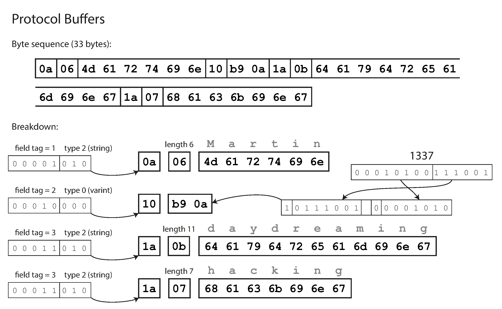

## Message

### 메세지 객체 톺아보기

`gRPC`에서 소개하는 `메세지`는 `클래스`와 매우 유사한 성질을 가지고 있습니다. 여러개의 필드를 묶어서 하나의 객체로 만들기 때문이죠. 다만, `클래스`와 다른 점이 있다면 `메세지`는 각각의 필드를 구성할 때 `자료형`, `필드명`, `필드순서`를 명시적으로 지정해야 한다는 것 입니다.

```protobuf
message EchoRequest {
    int32 a = 1;
    int32 b = 2;
    int32 c = 3;
}
```

<br/>

`필드순서`를 함께 지정해야 하는 이유는 메시지가 `직렬화`되어 전송되기 때문에 반대편에서 해당 메세지를 읽기 위해서는 `필드순서`와 `필드크기`를 파악하여 `프로토콜 버퍼`를 해석해야 하기 때문입니다.



<br/>

위의 그림에 대한 해석을 잠깐 하자면, 필드의 첫 바이트는 `필드순서`와 `데이터 타입`을 가르키고, 여기에서 읽은 `데이터 타입`을 바탕으로 데이터를 어떻게 해석할 것인지 결정합니다. `문자열`의 경우에는 데이터의 처음을 `문자열의 길이`로 해석하고 그 길이만큼 다음 데이터를 문자열로 해석합니다. `정수`의 경우에는 다음 데이터를 `빅-엔디안`으로 읽어서 해석하고 있습니다.

<br/>

### 스칼라 타입 필드

주로 사용되는 `프리미티브`타입은 다음과 같습니다.

|   Type   | Desc                                                                           |
| :------: | ------------------------------------------------------------------------------ |
|  double  | 배정밀도 부동소수점                                                            |
|  float   | 단정밀도 부동소수점                                                            |
|  int32   | 부호화된 가변크기 32비트 정수. (프로토콜 버퍼에서 바이트 크기가 바뀔 수 있음.) |
|  int64   | 부호화된 가변크기 64비트 정수.                                                 |
|  uint32  | 부호화되지 않은 가변크기 32비트 정수.                                          |
|  uint64  | 부호화되지 않은 가변크기 64비트 정수.                                          |
|  sint32  | 부호화된 가변크기 32비트 정수.                                                 |
|  sint64  | 부호화된 가변크기 64비트 정수.                                                 |
| fixed32  | 부호화되지 않은 고정크기 32비트 정수. (항상 바이트 크기가 변하지 않음.)        |
| fixed64  | 부호화되지 않은 고정크기 64비트 정수.                                          |
| sfixed32 | 부호화된 고정크기 32비트 정수.                                                 |
| sfixed64 | 부호화된 고정크기 64비트 정수                                                  |
|   bool   | 참, 거짓                                                                       |
|  string  | 문자열                                                                         |
|  bytes   | 바이트 배열 (`Buffer` 또는 `Uint8[]`)                                          |

<br/>

`가변크기 정수`는 작은 정수에 대해 압축하여 저장하므로 메세지의 크기는 감소하지만, 정수가 커질수록 오버헤드가 걸립니다. 이러한 시나리오의 손익분기점은 구글 공식문서에서 말하길 `32비트인 경우에는 2^28`, `64비트인 경우에는 2^56`입니다. 대체로 이 값보다 커진다면 `fixed`를 사용하는 것을 권장하고 있습니다.

```protobuf
message EchoRequest {
    int32 a = 1;
    int32 b = 2;
    int32 c = 3;
}
```

<br/>

`node.js`에서 필드에 값을 할당하는 방법은 다음과 같습니다. 각각의 `setter`이름은 `set[필드명]`입니다. 필드명의 첫 글자는 대문자로 변경됩니다.

```ts
import { Echo1Object } from "./proto/schema_pb";

//
// 데이터 삽입하기
const obj = new Echo1Object();
obj.setA(3);
obj.setB(6);
obj.setC(9);

//
// 데이터 가져오기
const a: number = obj.getA();
const b: number = obj.getB();
const c: number = obj.getC();
```

<br/>

### 메세지 타입 필드

스칼라 타입만이 아니라 기존에 정의한 메세지 타입도 사용할 수 있습니다.

```protobuf
//
// 내부 메세지 1
message InnerMessage1 {
    int32 a = 1;
    int32 b = 2;
}

//
// 내부 메세지 2
message InnerMessage2 {
    int32 x = 1;
    int32 y = 2;
}

//
// 내부 메세지 1, 2를 포함하는 외부 메세지.
message OuterMessage {
    InnerMessage1 m1 = 1;
    InnerMessage2 m2 = 2;
}
```

<br/>

`node.js`에서 내부 메세지 필드에 값을 할당하는 방법은 다음과 같습니다.

```ts
import { OuterMessage, InnerMessage1, InnerMessage2 } from "./proto/schema_pb";

//
// 데이터 삽입하기
const obj = new OuterMessage();
const m1 = new InnerMessage1();
const m2 = new InnerMessage2();
obj.setM1(m1);
obj.setM2(m2);

//
// 데이터 가져오기
const m1 = obj.getM1();
const m2 = obj.getM2();
```

<br/>

### 열거형 타입 필드

`열거형`도 사용할 수 있습니다. 이 때, 열거형의 첫 항목의 값은 항상 `0`이어야 합니다.

```protobuf
//
// 사용자 정의 열거형.
enum Direction {
    up = 0; // 첫 값은 항상 0이어야 한다.
    down = 1;
    left = 2;
    right = 999;
}

//
// 내부 메세지 1, 2와 열거형을 포함하는 외부 메세지.
message Echo2Object {
    InnerMessage1 m1 = 1;
    InnerMessage2 m2 = 2;
    Direction direction = 3;
}
```

<br/>

`node.js`에서 열거형 필드에 값을 할당하는 방법은 다음과 같습니다.

```ts
import { Echo2Object, Direction } from "./proto/schema_pb";

//
// 데이터 삽입하기
const obj = new Echo2Object();
obj.setDirection(Direction.UP);

//
// 데이터 가져오기
const dir: Direction = obj.getDirection();
```

<br/>

### 배열 타입 필드

자료형의 앞에 `repeated`를 붙이면 배열로 바뀝니다.

```protobuf
//
// 정수형 배열 메세지.
message Echo3Object {
    repeated int32 x = 1;
}
```

<br/>

`node.js`에서 배열에 값을 추가하는 방법은 다음과 같습니다.

```ts
import { Echo3Object } from "./proto/schema_pb";

//
// 데이터 삽입하기
const obj = new Echo3Object();
for (let i = 0; i < 10; i++) {
    obj.addX(i);
}

//
// 데이터 가져오기
const arr: number[] = obj.getXList();
```

<br/>

### `required`, `optional`

`proto2`문법에서 지원했던 `required`, `optional` 기능은 `proto3`으로 넘어오면서 삭제되었습니다. `proto3`에서 사용된 모든 필드는 항상 `optional`입니다.

<br/>

### 기본값

`.proto`에서 각 필드는 사용자 정의 기본값을 사용할 수 없습니다. 단, 데이터가 삽입되지 않은 필드를 수신측이 참조할 때에는 기본값으로 대체됩니다.

|   Type   | Desc             |
| :------: | ---------------- |
| numberic | `0`              |
|   bool   | `false`          |
|  string  | `빈 문자열`      |
|  bytes   | `빈 바이트 배열` |
